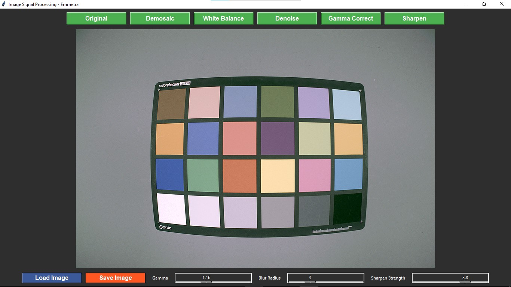
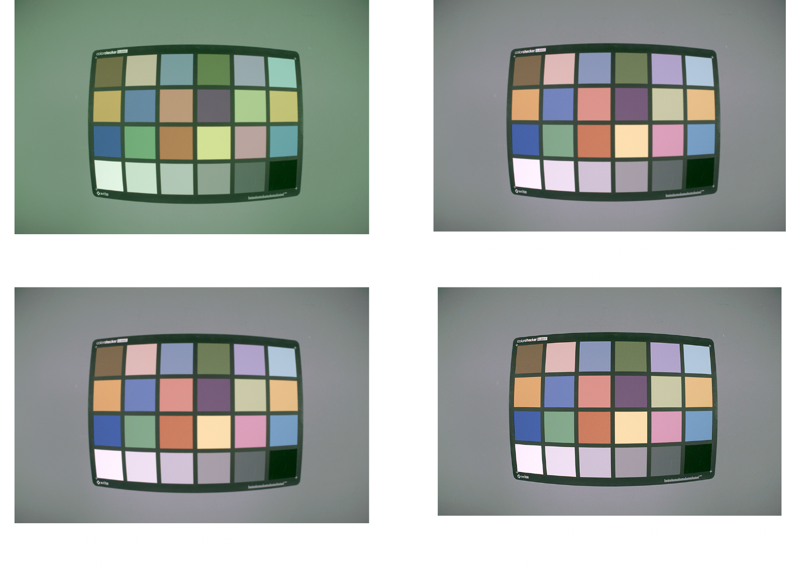

# Image Signal Processing Pipeline - Emmetra

This project implements a basic **Image Signal Processing (ISP)** pipeline for sensor RAW images using a user-friendly GUI. The tool processes 12-bit Bayer RAW images and performs various ISP stages such as demosaicing, white balance, denoising, gamma correction, and sharpening. The GUI enables users to visualize and interact with the image processing pipeline.

---

## Features

- **Load and View RAW Images**: Load 12-bit Bayer RAW images and view them as RGB images.
- **Demosaicing**: Converts the Bayer pattern to an RGB image using edge-based interpolation.
- **White Balance**: Removes color casts using a simple gray-world algorithm.
- **Denoising**: Applies a 5x5 Gaussian filter to reduce noise.
- **Gamma Correction**: Adjusts brightness using sRGB gamma correction.
- **Sharpening**: Enhances details using an unsharp mask filter.
- **Save Processed Images**: Save the final processed image in PNG format.
- **GUI Control**: Toggle between various processing stages via intuitive buttons.

---

## How It Works

1. **Load Image**: The user loads a 12-bit Bayer RAW image (e.g., GRBG pattern) using the **Load Image** button.
2. **Process Image**: The ISP stages can be applied individually or in sequence:
   - **Demosaic**: First step applied immediately after loading.
   - **White Balance**: Removes unwanted tints from the image.
   - **Denoise**: Reduces image noise.
   - **Gamma Correct**: Enhances brightness.
   - **Sharpen**: Refines image details.
3. **Save Image**: The processed image can be saved in PNG format.
- The GUI works better on `Windows` environment

---

## GUI Overview

Below is a snapshot of the **Image Signal Processing Pipeline - Emmetra** GUI:



---

## Installation

### Prerequisites
Ensure you have Python 3.8 or above installed.

### Install Dependencies
Run the following command to install required libraries:
```bash
pip install -r requirements.txt
```
---

## Usage

1. Clone the repository or copy the script file into your working directory.
2. Run the script:
   ```bash
   python main_GUI.py
   ```
3. Use the GUI to load, process, and save images.

---

## File Format Requirements

- Input: 12-bit Bayer RAW image (e.g., `.raw`) with GRBG configuration and dimensions `1920x1280`.
- Output: RGB image with 8 bits per channel in PNG format.

---

## Processing Stages Overview

| Stage             | Description                                                                 |
|--------------------|-----------------------------------------------------------------------------|
| **Demosaic**       | Converts Bayer RAW to RGB using edge-based interpolation.                  |
| **White Balance**  | Applies gray-world correction to balance color channels.                   |
| **Denoise**        | Reduces noise using a 5x5 Gaussian filter.                                 |
| **Gamma Correct**  | Applies sRGB gamma correction (default gamma = 1.1).                       |
| **Sharpen**        | Enhances edges using an unsharp mask filter (blur radius = 5, strength = 3.8). |

---

## Combinations and Recorded Observations

This tool allows users to generate outputs with various stage combinations for comparison.
- Demosaic + Gamma Correction
- Demosaic + White Balance + Gamma Correction
- Demosaic + White Balance + Denoise + Gamma Correction
- Demosaic + White Balance + Denoise + Gamma Correction + Sharpen



---

## Challenges faced

- Implemented Demosaicing using edge interpolation 5x5 technique but integration problem with the Image Signal Processing(ISP) Pipeline therefore utilised OpenCV's inbuilt demosaicing algorithm, cv2.cvtColor(bayer_image_normalized, cv2.COLOR_BAYER_GR2BGR) which uses linear interpolation algorithm. The demosaicing code for edge interpolation 5x5 can be found in the [codes](codes) folder.
- Incorrect mapping of gamma values leading to overly bright images. Fixed it by custom user tuning for gamma value depending on the image.
- Incorrect display of output images due to wrong channel configurations. OpenCV works in BGR while display needed to be RGB. Corrected it by going through documentation.

---

