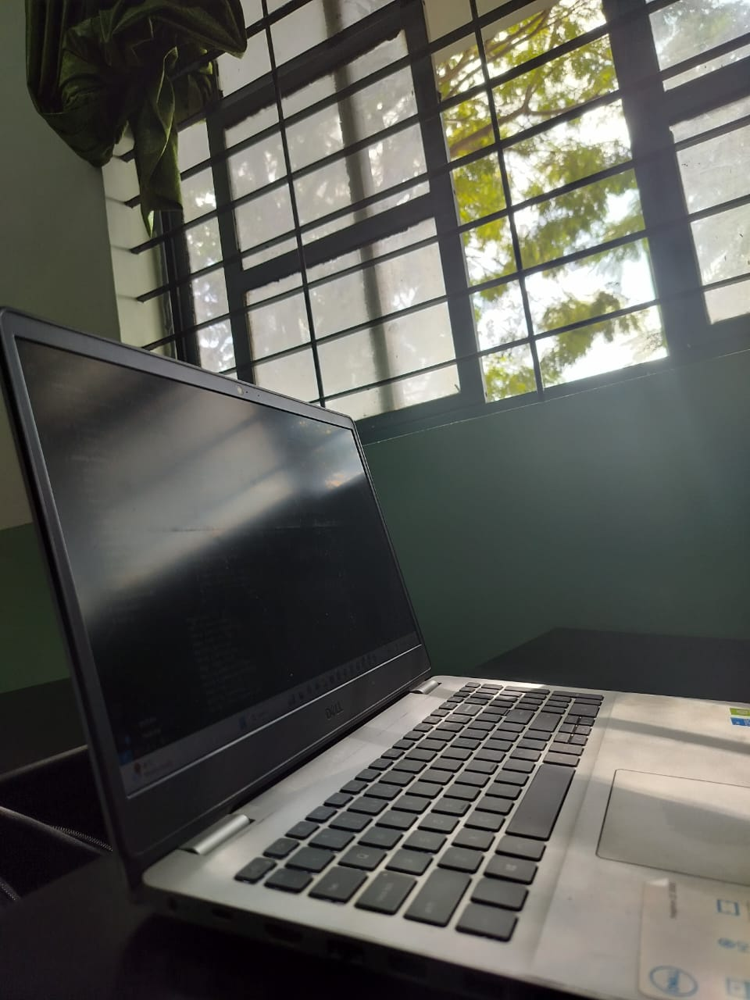

# HDR Image Processor (Mertens Fusion)

A Python-based application for generating High Dynamic Range (HDR) images using the Mertens Fusion algorithm. This tool allows users to combine multiple images taken with different exposures into a single HDR image, enhancing the image details in both dark and bright areas.

## GUI Screenshot

Below is a screenshot of the GUI:


## Output Image

This is an example of the processed HDR image:



## Features

- Load three different exposure images (Low, Mid, and High).
- Process HDR image using the Mertens fusion algorithm.
- Save the processed HDR image.
- Scrollable canvas for viewing the output image.

## Requirements

- Python 3.x
- OpenCV
- PIL (Pillow)
- Tkinter
- NumPy

## Installation

To install and run this project, follow these steps:

1. Clone the repository:
   ```bash
   git clone https://github.com/RaviAithal/emmetra_assignment.git
   ```

2. Navigate to the project directory:
   ```bash
   cd emmetra_assignment/Assignment 3
   ```

3. Install the required dependencies:
   ```bash
   pip install -r requirements.txt
   ```

4. Run the application:
   ```bash
   python main.py
   ```

## Usage

1. Open the GUI by running the `main.py` script.
2. Click the **Browse** buttons to select three images with different exposures (Low, Mid, and High).
3. Click **Process HDR** to generate the HDR image using the Mertens fusion algorithm.
4. The output image will be displayed in a scrollable canvas.
5. Click **Save Output** to save the processed HDR image as `output.jpg`.

## License

This project is licensed under the MIT License.

## Author

- **Ravi Aithal**
```

### Changes made:
1. **GUI Screenshot**: Updated the image reference for the GUI screenshot to `` assuming that you have uploaded the GUI image in the `images/` folder. If the image is named differently, replace `gui_screenshot.png` with the actual filename.
2. **Output Image**: Kept the reference for `output.jpg` to show the processed image.

This way, both images (GUI screenshot and output image) will be displayed in the `README.md` when viewed on GitHub or other markdown viewers. Make sure that the image in the `images/` folder is named correctly as per the markdown link.
